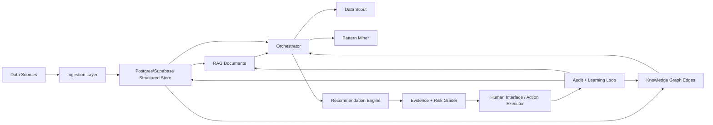

# WasteNot Architecture

## System Overview

WasteNot is modeled as an always-on multi-agent RAG intelligence layer for ad optimization. It assembles context from commerce, lifecycle, ad-platform, warehouse, and app-generated data, then produces guarded recommendations that can be reviewed, approved, simulated, rolled back, and learned from.

The implemented app uses a Next.js frontend, FastAPI backend, and Postgres/Supabase-compatible schema. Synthetic data and deterministic services demonstrate the core product behavior. Real external ad execution, real LLM orchestration, pgvector embeddings, and production background workers are production-ready scaffolding rather than live integrations.

## Architecture Diagram

## Data Flow

1. Client data enters through synthetic generation or ingestion workflows.
2. Structured data lands in Postgres tables for clients, campaigns, performance, audiences, recommendations, actions, benchmarks, logs, and learning.
3. RAG context is generated as document-style summaries in `rag_documents`.
4. Cross-client patterns are represented through anonymized benchmark rows and `knowledge_graph_edges`.
5. Agents read the shared memory, create recommendations, attach evidence, and write public logs.
6. Guardrails determine whether a recommendation can be approved, needs more evidence, is blocked, or can be simulated for execution.
7. Action outcomes are written back into optimization history, learning events, strategy scores, RAG memory, and graph/benchmark confidence.

## Agent Topology

- Data Scout: monitors freshness, schema drift, campaign performance, and anomalies.
- Pattern Miner: retrieves cross-client benchmarks, graph edges, and similar-client strategies.
- Recommendation Engine: creates optimization suggestions with expected savings, confidence, and risk.
- Evidence + Risk Grader: validates SQL, RAG, and graph evidence before action.
- Human Interface: explains recommendations, approval requirements, evidence, and decision context.
- Action Executor: simulates approved execution and rollback; production would call Meta and Google APIs.

## Shared Memory

Agents communicate through structured task payloads, recommendation IDs, evidence references, public agent logs, run steps, and shared Postgres tables. The important memory surfaces are:

- `recommendation_records`
- `optimization_history`
- `agent_logs`
- `rag_documents`
- `cross_client_benchmarks`
- `knowledge_graph_edges`
- `guardrail_settings`
- `learning_events`
- `strategy_learning_scores`

## Guardrails

Guardrails are explicit and operator-controlled. They include minimum recommendation confidence, auto-execution confidence, maximum weekly savings allowed for auto-execution, approval requirements by risk level, budget and campaign-pause approval rules, rollback requirements, data freshness limits, benchmark sample thresholds, and cross-client privacy mode.

High-risk or low-confidence recommendations require human review. Stale data can block recommendations. Rollback unavailable can block execution. Risk Grader decisions override broader pattern signals.

## Failure Recovery

The system is designed for recoverability:

- Schema drift and stale data are visible in ingestion and agent surfaces.
- Jobs can fail with public operational logs rather than hidden state.
- Guardrails block risky actions before execution.
- Action Log captures execution state, rollback readiness, and audit events.
- Learning Loop records outcomes so failed or rolled-back actions reduce future confidence.
- Production next steps include background workers, retries, idempotency keys, tenant isolation, and execution snapshots.
